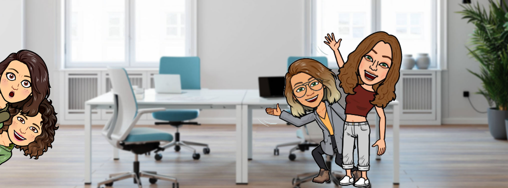

# Adatools 

Este es el primer proyecto del grupo **Adatools** dentro de la formación de Adalab.
Se trata de una web colaborativa en el que nos damos a conocer y a través del cual mostramos los conocimientos adqueridos, con ello buscamos hacernos un hueco en el sector de la programación y facilitar el contacto con potenciales recrutadores.

A través de este link podrás ver el resultado final de la página y conocernos un poquito más:

http://beta.adalab.es/project-promo-l-module-1-team-9/

